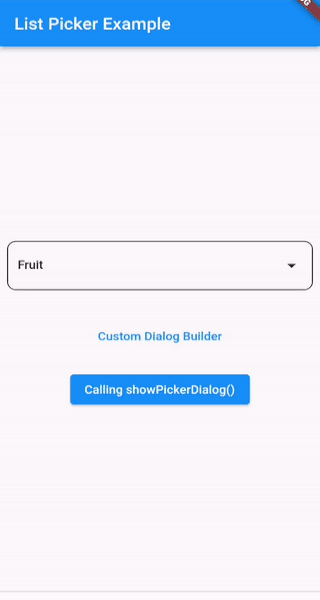

list_picker helps you to select an item from a list of items using dialog box without having to write a lot of code.

## Features

- `ListPickerField` provides a text field which when tapped opens the dialog box to select item from the given list.
- You can also customize `showDialog` and its `builder` method with `ListPickerDialog` widget.
- Or you can call the `showPickerDialog` function on your custom widget.



## Getting started

#### Add to Dependencies

```yaml
list_picker: ^0.0.1
```

#### Import the package

```dart
import 'package:list_picker/list_picker.dart';
```

## Usage

#### Using variable for the Widget to get values

```dart
class VariableDemo extends StatelessWidget {
  VariableDemo({Key? key}) : super(key: key);

  final listPickerField = ListPickerField(
    label: "Fruit",
    items: const ["Apple", "Banana", "Orange", "Pineapple"],
  );

  @override
  Widget build(BuildContext context) {
    return Scaffold(
      body: Center(
        child: listPickerField,
      ),
    );
  }
}
```

#### Using controller to get values

```dart
class ControllerDemo extends StatelessWidget {
  ControllerDemo({Key? key}) : super(key: key);

  final controller = TextEditingController();

  @override
  Widget build(BuildContext context) {
    return Scaffold(
      body: Center(
        child: ListPickerField(
          label: "Fruit",
          items: const ["Apple", "Banana", "Orange", "Pineapple"],
          controller: controller,
        ),
      ),
    );
  }
}
```

#### Using showPickerDialog function on custom widget

```dart
class DialogFunctionDemo extends StatelessWidget {
  const DialogFunctionDemo({Key? key}) : super(key: key);

  @override
  Widget build(BuildContext context) {
    return Scaffold(
      body: Center(
        child: ElevatedButton(
          onPressed: () async {
            String? fruit = await showPickerDialog(
              context: context,
              label: "Fruit",
              items: const ["Apple", "Banana", "Orange", "Pineapple"],
            );

            ScaffoldMessenger.of(context).showSnackBar(
              SnackBar(
                content: Text(fruit ?? "No fruit selected"),
              ),
            );
          },
          child: const Text("Select Your Favourite fruit"),
        ),
      ),
    );
  }
}
```

#### Using ListPickerDialog Widget for custom use

```dart
class ListPickerDialogDemo extends StatelessWidget {
  const ListPickerDialogDemo({Key? key}) : super(key: key);

  @override
  Widget build(BuildContext context) {
    return Scaffold(
      body: Center(
        child: ElevatedButton(
          onPressed: () async {
            String? fruit = await showDialog(
              context: context,
              builder: (context) => Scaffold(
                appBar: AppBar(
                  title: const Text('List Picker Dialog'),
                ),
                body: const ListPickerDialog(
                  label: "Fruit",
                  items: ["Apple", "Banana", "Orange", "Pineapple"],
                ),
              ),
            );

            ScaffoldMessenger.of(context).showSnackBar(
              SnackBar(
                content: Text(fruit ?? "No fruit selected"),
              ),
            );
          },
          child: const Text("Select Your Favourite fruit"),
        ),
      ),
    );
  }
}
```

## ListPickerField Getter Methods

- value: returns the selected value
- empty: returns true if no value is selected
